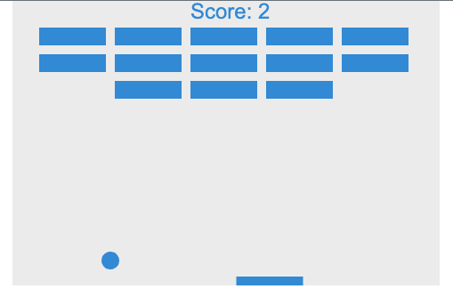

# Simple breakout. In the the browser using canvas 2d!

## Pretty darn small could fit into a banner ad.
### // TODOs
- [ ] convert silly alert box to da new dialog box
- [ ] add sounds yep go old school and add in the oh so nice 8-bit sounds?
- [ ] add textures?
- [ ] getting a bit long could break out functions into seperate files.

Simple demostration of 2d canvas, demonstrates JS, can always improve, but hey it's working

### To run simply download and start index.html in a browser.
